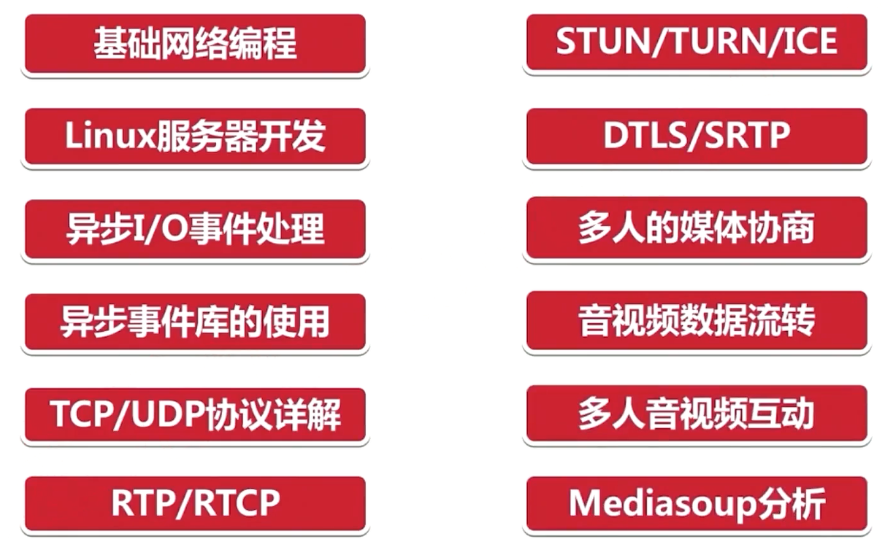
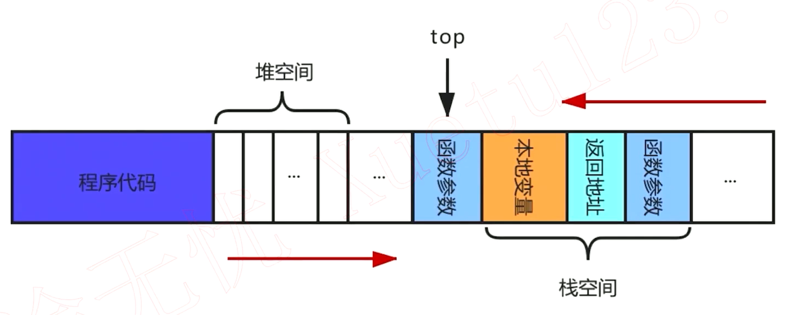
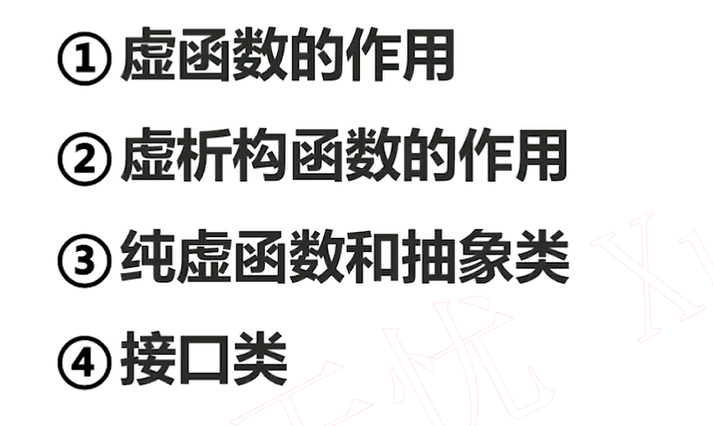
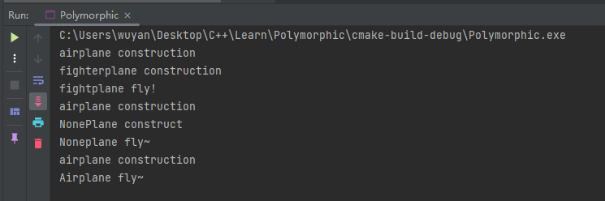
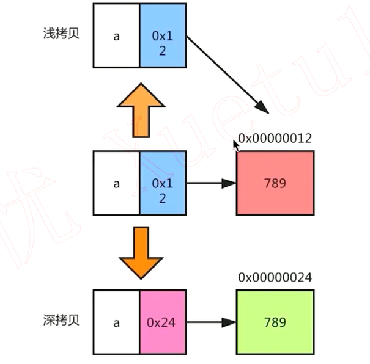
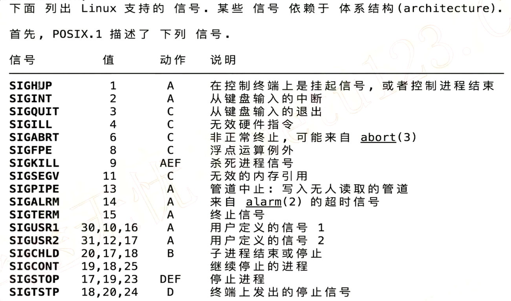
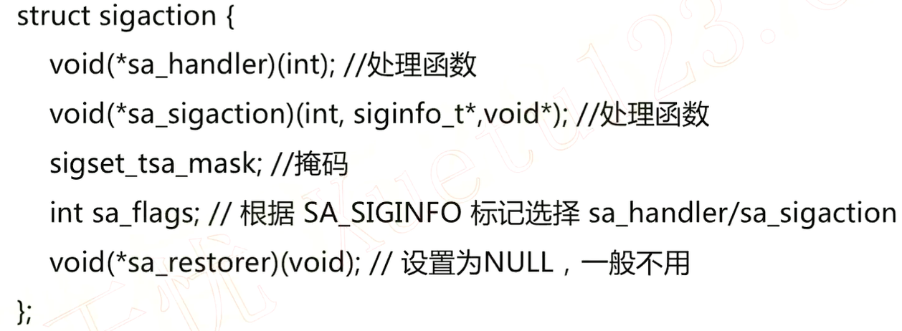

# 流媒体服务器

## 一.导学

1. 什么是`webrtc`

​		跨平台开源项目，用于浏览器之间的实时通信，快速开发音视频

​		特点是：实时传输，延迟200ms之内，实际不会超过800ms；音视频引擎，声音和图像一致，对于丢包进行引擎层的优化

2. 什么是流媒体服务器

​		`webrtc`是一对一的，流媒体服务器的中转可以实现多人的，（在线教育，远程医疗

3. 特点

   基于mediasoup，支持多人互动，高负载，大并发，实时传输

4. 涉及到的知识点

   异步io，网络编程，服务端的开发，所有的网络传输协议

5. 过程

   

   6.高性能网络编程

   select epoll 异步I/O事件处理  libevent/libuv处理异步I/O事件

   7.技术栈

   

## 二.C++回顾

1. 栈和堆

   栈: 一般是用来存放局部变量（包括临时变量）和函数参数的，<font color = "red"> **由编译器管理分配和回收**</font>

   堆: 用来显式的进行手动`new` `malloc` , `delete`,  `delete [] `,  `free`，空间较大，<font color="red"> **由程序员进行管理** </font>
   
   
   
   堆地址从低地址到高地址
   
   栈空间从高地址到低地址（函数参数 $\to$ 返回地址$\to$ 本地变量 $\to$ 函数参数[top] ）
   
   避免两个地址发生冲突，向中间靠拢
   
   

2. 命名空间

   为了避免冲突，可以将两个独立的部分放到两个不同的命名空间里进行隔离。所以说我们可以定义若干个不同的命名空间，然后封装到命名空间内。

   对于要使用某一个命名空间内的函数或者说是类、方法等，可以将其引入通过`using namespace NAME;`，除此之外还可以将其通过`NAME::func`等进行调用，比如在输入的时候可以直接`std::cin` 或者是在代码中添加`using namespace std;`

3. 多层继承，多重继承

   多层继承：爷爷 父亲 儿子

   多重继承：儿子继承于爸爸和妈妈

4. 继承之后，基类无法访问子类的东西，只有自己的一段属性

   而对于继承之后子类，可以访问基类的东西，编译器将一些东西糅合在一起

5. 多态

   C++的多态的实现方式：

   

   积累的指针指向不同的子类调用相同的的虚函数实现多态:

   ```cpp
   #include <iostream>
   #include "AirPlane.h"
   #include "FightPlane.h"
   #include "NonePlane.h"
   
   int main() {
   //    std::cout << "Hello, World!" << std::endl;
       avdance::AirPlane* ap = new avdance::FightPlane();
       if(ap) ap->fly();
   
       ap = new avdance::NonePlane();
       if(ap) ap->fly();
   
       ap = new avdance::AirPlane();
       if(ap) ap->fly();
   
       return 0;
   }
   ```

   结果：

   

6. 深拷贝 && 浅拷贝

   浅拷贝：指针变量的内容进行拷贝，而指针所指向的内容不进行拷贝（指向共享变量，释放内存的时候可能会导致崩溃）

   深拷贝：指针变量的内容进行拷贝，将指针所指向的内容也进行一个拷贝

   

## 三.服务器基础

1. 服务器下 man手册

   `man 7 signal`可以获取



2. 重要的信号

   (1). 概述

SIGPIPE 管道中之，当写入无人读取的管道时产生该信号，默认终止进程

SIGCHILD 子进程结束或停止时发送

SIGALRM 定时器信号，以秒为单位，默认终止进程

SIGUSR1 SIGUSR2 自定义，默认终止进程

SIGINT 键盘输入的推出信号

SIGQUIT 键盘退出时输入的信号esc

SIGHUP 控制终端的挂起信号

  	(2). 详解

SIGPIPE 网络程序必须要处理的信号，否则当客户端推出之后，服务器仍然向该socket发送数据时，则会引起crash<font color="red">【不处理导致崩溃】</font>

SIGCHILD 僵尸进程是一个已经死亡的进程，但是在进程表中仍然占有位置；在Linux中当子进程结束的时候，并没有被完全销毁，因为父进程还要用到他的信息；父进程没有处理SIGCHLD信号或调用wait / waitpid()等待子进程结束，就会出现僵尸进程。<font color="red"> 【处理不好导致僵尸进程】</font>

3. 发送信号的方式

   硬件：

   ctrl c

   ctrl \

   软件：

   kill api

   安装信号：

   (1) 基础方法

   ```cpp
   signal(int sig, void(*func)(int));
   ```

    具体使用：

   ```cpp
   #include <iostream>
   #include <signal.h>
   #include <unistd.h>
   
   void sighandle(int sig) {
       std::cout << "received a signal: " << sig << std::endl;
   }
   
   int main() {
   //    std::cout << "Hello, World!" << std::endl;
       signal(SIGINT, sighandle);
       signal(SIGQUIT, sighandle);
       signal(SIGHUP, sighandle);
   
       pause();
       return 0;
   }
   ```

   ```c++
   SIGINT 2   CTRL C
   SIGQUIT 3  CTRL \
   ```

   （2）高级方法

   ```cpp
   int sigaction(int sig, 
                 const struct sigaction* act, 
                 struct sigaction* oact);
   ```

   

   

   具体使用：

   ```cpp
   #include <iostream>
   #include <signal.h>
   #include <unistd.h>
   
   void sighandle(int sig) {
       std::cout << "received a signal: " << sig << std::endl;
   }
   
   int main() {
   //    part 2
       struct sigaction act, odact;
       act.sa_handler = sighandle;
       sigfillset(&act.sa_mask);
       act.sa_flags = 0;
   
       sigaction(SIGINT, &act, &odact);
   
       pause();
       return 0;
   }
   ```

   

4. 信号的处理方式

